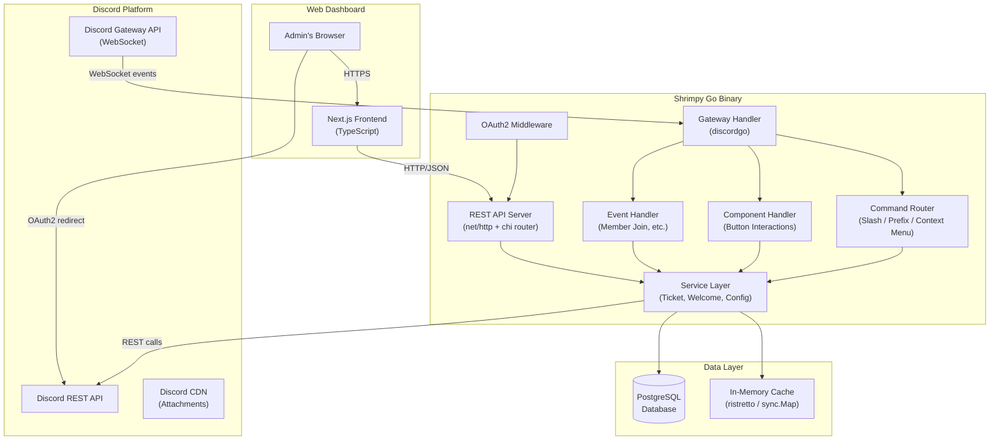
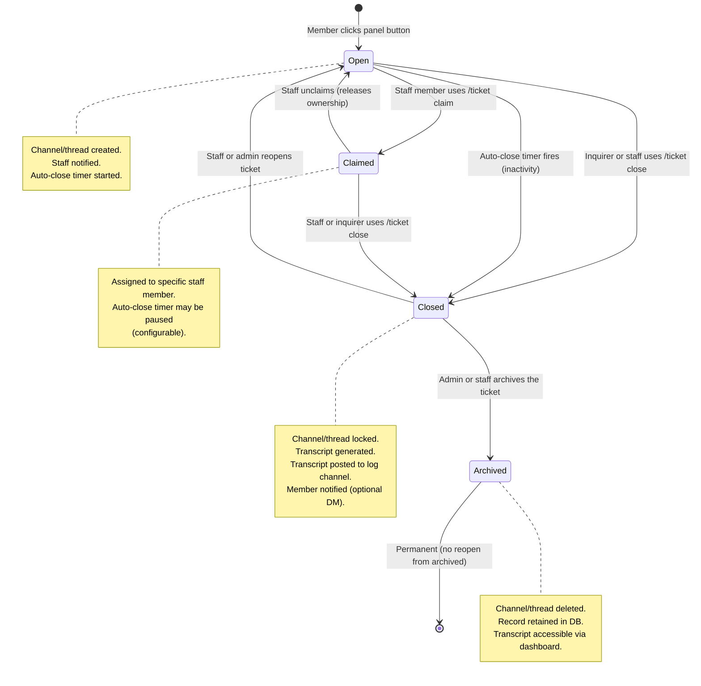

# Technical Specification Document
## Project: **Shrimpy** 🦐 — Discord Bot Technical Architecture

> **Version**: 1.0.0-draft
> **Status**: In Review
> **Last Updated**: 2026-06-21
> **Author**: Engineering Team

---

## Table of Contents

1. [Architecture Overview](#1-architecture-overview)
2. [Technology Stack & Justifications](#2-technology-stack--justifications)
3. [Database Schema](#3-database-schema)
4. [REST API Design](#4-rest-api-design)
5. [Discord Event Handling](#5-discord-event-handling)
6. [Ticket Lifecycle State Machine](#6-ticket-lifecycle-state-machine)
7. [Authentication — Discord OAuth2](#7-authentication--discord-oauth2)
8. [Project Directory Structure](#8-project-directory-structure)
9. [Configuration & Environment Variables](#9-configuration--environment-variables)
10. [Deployment Architecture](#10-deployment-architecture)
11. [Design System](#11-design-system)

---

## 1. Architecture Overview

Shrimpy follows a **monorepo, multi-tier architecture**. A single Go binary acts as both the Discord bot and the REST API server for the web dashboard. The Next.js frontend communicates exclusively with this API. All persistent state lives in PostgreSQL.



### Key Architectural Decisions

- **Single binary**: The Go bot and REST API run in the same process, sharing the service layer. This simplifies deployment and eliminates inter-service latency.
- **Vertical feature packages & layer isolation**: Business logic, models, repositories, API endpoints, and bot commands are packaged vertically by feature scope under `internal/app/<feature>/` (subdivided by layers), keeping the modules highly encapsulated.
- **Caching**: Guild configuration is cached in-memory (with TTL) to avoid a DB round-trip on every Discord event.
- **Asynchronous transcript generation**: Transcript building is done in a goroutine pool to avoid blocking Discord event processing.

---

## 2. Technology Stack & Justifications

### 2.1 Go (golang.org) — Bot Runtime

| Factor | Justification |
|--------|---------------|
| **Performance** | Goroutines enable handling thousands of concurrent Discord events with minimal memory overhead compared to Node.js or Python bots. |
| **Single binary deployment** | `go build` produces a self-contained binary — no runtime interpreter required on the server. |
| **Strong typing** | Catches Discord API contract mismatches at compile time. |
| **discordgo library** | Mature, actively maintained, supports all Discord API features including slash commands, components, and threads. |
| **Standard library** | `net/http` is production-grade for the REST API; no heavyweight framework needed. |

### 2.2 PostgreSQL — Database

> [!IMPORTANT]
> PostgreSQL is the **strongly recommended** database for this project. Here's why:

| Factor | Justification vs. Alternatives |
|--------|--------------------------------|
| **Multi-server scalability** | Every table is scoped to `guild_id`. Adding a new server requires zero schema changes — just new rows. SQLite cannot handle concurrent writes across multiple guilds safely. |
| **JSONB support** | Panel configurations, template variables, and settings are stored as JSONB, enabling flexible schema evolution without migrations for every new config key. |
| **Full-text search** | PostgreSQL's `tsvector` enables future transcript search features without a separate search engine. |
| **Transactions** | Ticket creation involves multiple writes (ticket row + channel creation + permission overrides). ACID transactions ensure consistency if any step fails. |
| **Connection pooling** | Used with `pgxpool` (Go library), PostgreSQL handles hundreds of concurrent queries from both bot events and dashboard API calls. |
| **Mature ecosystem** | Battle-tested in production at scale; excellent tooling (`psql`, `pgAdmin`, `flyway`/`golang-migrate` for schema migrations). |

**Why not SQLite?** SQLite's single-writer model becomes a bottleneck under concurrent bot events. It's unsuitable once a second server is added.

**Why not MongoDB?** Ticket messages and relationships are inherently relational. A document store would require application-level joins, degrading performance and correctness.

### 2.3 discordgo — Discord Library

| Factor | Detail |
|--------|--------|
| **Maturity** | One of the oldest and most widely used Go Discord libraries |
| **API coverage** | Full coverage of Discord's Gateway, REST, and interaction APIs |
| **Active maintenance** | Regularly updated for new Discord API versions |
| **Goroutine-safe** | Thread-safe session management compatible with concurrent event handling |

### 2.4 Next.js + TypeScript — Web Dashboard Frontend

| Factor | Justification |
|--------|---------------|
| **React ecosystem** | Largest component library ecosystem; rich UI component options (shadcn/ui, Radix, etc.) |
| **TypeScript** | End-to-end type safety; API response types can be shared or generated from Go structs |
| **Server Components** | Next.js App Router enables server-side rendering for faster initial load and better SEO |
| **API Routes** | Can proxy OAuth2 token exchange server-side, keeping the Discord client secret off the browser |
| **Vercel deployment** | Zero-config deployment; works equally well on self-hosted Node.js |

### 2.5 Chi Router — HTTP Router (Go)

Lightweight, idiomatic HTTP router that adds middleware support and URL parameter parsing on top of `net/http` without a heavy framework dependency.

### 2.6 Design System — Shrimpy Visual Identity

The web dashboard follows the **Shrimpy Design System**, fully documented in [DESIGN_SYSTEM.md](file:///C:/Users/salma/.gemini/antigravity/brain/b4030e12-7742-4037-8993-2a82af0962f3/DESIGN_SYSTEM.md).

| Aspect | Choice | Rationale |
|--------|--------|-----------|
| **Dark Theme** | Deep navy (`#1A1830`) base, coral primary (`#FF7B6B`), ocean teal accent (`#4ECDC4`) | Ocean-at-night aesthetic; warm coral reinforces the Shrimpy brand identity |
| **Light Theme** | Sandy cream (`#FFF8F2`) base, deep coral primary (`#E8503A`), deep teal accent (`#2A9D8F`) | Tropical beach aesthetic; maintains brand coherence with sufficient WCAG contrast |
| **Typography** | Outfit (display), Inter (body), JetBrains Mono (code) | Modern, friendly, highly readable — all available on Google Fonts |
| **Theme Switching** | `data-theme` on `<html>`, persisted in `localStorage` | Zero-flash theme switching with FOUC-prevention inline script |
| **Tokens** | CSS custom properties on `:root` | Theme-agnostic component code; single-line theme switch |

---

## 3. Database Schema

> [!NOTE]
> All tables include `created_at TIMESTAMPTZ DEFAULT NOW()` and `updated_at TIMESTAMPTZ DEFAULT NOW()` unless otherwise noted. Indexes on foreign keys and common query patterns are included.

### 3.1 Entity Relationship Overview

```mermaid
erDiagram
    discord_apps {
        UUID id PK
        VARCHAR name
        BYTEA discord_token_enc
        VARCHAR discord_client_id
        BYTEA discord_client_secret_enc
        TEXT discord_redirect_uri
        TIMESTAMPTZ created_at
        TIMESTAMPTZ updated_at
    }

    discord_apps ||--o{ guilds : "manages"
    guilds ||--o{ ticket_panels : "has"
    guilds ||--o{ tickets : "has"
    guilds ||--|| welcome_config : "has"
    guilds ||--o{ auto_roles : "has"
    guilds ||--o{ staff_roles : "has"
    guilds ||--o{ reaction_role_messages : "has"
    reaction_role_messages ||--o{ reaction_role_emojis : "has"
    ticket_panels ||--o{ ticket_categories : "contains"
    ticket_categories ||--o{ tickets : "has"
    tickets ||--o{ ticket_messages : "has"
    users ||--o{ tickets : "opens"

    guilds {
        BIGINT guild_id PK
        UUID discord_app_id FK
        VARCHAR prefix
        VARCHAR language
        VARCHAR bot_nickname
        BIGINT log_channel_id
        TIMESTAMPTZ created_at
        TIMESTAMPTZ updated_at
    }

    ticket_panels {
        UUID id PK
        BIGINT guild_id FK
        VARCHAR name
        BIGINT channel_id
        VARCHAR message_id
        VARCHAR panel_style
        TEXT embed_title
        TEXT embed_description
        INTEGER embed_color
        JSONB embed_media
        TIMESTAMPTZ created_at
        TIMESTAMPTZ updated_at
    }

    ticket_categories {
        UUID id PK
        UUID panel_id FK
        VARCHAR name
        VARCHAR emoji
        VARCHAR button_label
        VARCHAR button_style
        VARCHAR button_description
        SMALLINT button_order
        VARCHAR ticket_destination
        TEXT ticket_open_title
        TEXT ticket_open_message
        INTEGER ticket_open_color
        JSONB ticket_open_media
        VARCHAR ticket_name_template
        INT max_tickets_per_user
        INT auto_close_hours
        BIGINT transcript_channel_id
        BOOLEAN allow_user_close
        TIMESTAMPTZ created_at
        TIMESTAMPTZ updated_at
    }

    tickets {
        UUID id PK
        BIGINT guild_id FK
        UUID category_id FK
        BIGINT channel_id
        VARCHAR thread_id
        BIGINT opened_by FK
        BIGINT claimed_by
        VARCHAR status
        VARCHAR priority
        VARCHAR close_reason
        TIMESTAMPTZ auto_close_at
        TIMESTAMPTZ closed_at
        TIMESTAMPTZ created_at
        TIMESTAMPTZ updated_at
    }

    ticket_messages {
        UUID id PK
        UUID ticket_id FK
        BIGINT author_id
        VARCHAR author_username
        TEXT content
        BOOLEAN is_staff_note
        JSONB attachments
        TIMESTAMPTZ sent_at
    }

    welcome_config {
        BIGINT guild_id PK FK
        BOOLEAN enabled
        TEXT dm_message
        BIGINT channel_id
        TEXT channel_message
        INTEGER embed_color
        JSONB embed_media
        TIMESTAMPTZ created_at
        TIMESTAMPTZ updated_at
    }

    auto_roles {
        UUID id PK
        BIGINT guild_id FK
        BIGINT role_id
        TIMESTAMPTZ created_at
    }

    reaction_role_messages {
        UUID id PK
        BIGINT guild_id FK
        BIGINT channel_id
        VARCHAR message_id
        TEXT embed_title
        TEXT embed_description
        INTEGER embed_color
        JSONB embed_media
        TIMESTAMPTZ created_at
        TIMESTAMPTZ updated_at
    }

    reaction_role_emojis {
        UUID id PK
        UUID message_id FK
        VARCHAR emoji
        BIGINT role_id
        TIMESTAMPTZ created_at
    }

    staff_roles {
        UUID id PK
        BIGINT guild_id FK
        BIGINT role_id
        TIMESTAMPTZ created_at
    }

    users {
        BIGINT user_id PK
        VARCHAR username
        VARCHAR discriminator
        VARCHAR avatar_hash
        TIMESTAMPTZ last_seen
        TIMESTAMPTZ created_at
    }
```

### 3.2 Table Definitions (DDL)

```sql
-- ─── Discord Application Settings (Multi-Bot support) ────────────────────────
-- Stores multiple Discord bots/applications managed by this backend.
-- All sensitive values are AES-256-GCM encrypted at rest.
CREATE TABLE discord_apps (
    id                          UUID        PRIMARY KEY DEFAULT gen_random_uuid(),
    name                        VARCHAR(255)NOT NULL,
    discord_token_enc           BYTEA       NOT NULL,   -- AES-256-GCM encrypted bot token
    discord_client_id           VARCHAR(30) NOT NULL UNIQUE,
    discord_client_secret_enc   BYTEA       NOT NULL,   -- AES-256-GCM encrypted
    discord_redirect_uri        TEXT        NOT NULL,
    created_at                  TIMESTAMPTZ NOT NULL DEFAULT NOW(),
    updated_at                  TIMESTAMPTZ NOT NULL DEFAULT NOW()
);

-- Guild configuration root table
CREATE TABLE guilds (
    guild_id       BIGINT       PRIMARY KEY,
    discord_app_id UUID         REFERENCES discord_apps(id) ON DELETE SET NULL,
    prefix         VARCHAR(10)  NOT NULL DEFAULT '!',
    language       VARCHAR(10)  NOT NULL DEFAULT 'en',
    bot_nickname   VARCHAR(32),                        -- Custom display name for this server; NULL = use global name "Shrimpy"
    log_channel_id BIGINT,
    created_at     TIMESTAMPTZ  NOT NULL DEFAULT NOW(),
    updated_at     TIMESTAMPTZ  NOT NULL DEFAULT NOW()
);

-- Ticket panels (the public embed message)
CREATE TABLE ticket_panels (
    id               UUID         PRIMARY KEY DEFAULT gen_random_uuid(),
    guild_id         BIGINT       NOT NULL REFERENCES guilds(guild_id) ON DELETE CASCADE,
    name             VARCHAR(100) NOT NULL,
    channel_id       BIGINT       NOT NULL,
    message_id       VARCHAR(30),
    panel_style      VARCHAR(20)  NOT NULL DEFAULT 'buttons', -- 'buttons' (max 3) or 'select_menu' (max 25)
    embed_title      TEXT,
    embed_description TEXT,
    embed_color      INTEGER,
    embed_media      JSONB        NOT NULL DEFAULT '{}',
    created_at       TIMESTAMPTZ  NOT NULL DEFAULT NOW(),
    updated_at       TIMESTAMPTZ  NOT NULL DEFAULT NOW()
);
CREATE INDEX idx_ticket_panels_guild ON ticket_panels(guild_id);

-- Ticket categories (individual buttons or select menu options)
CREATE TABLE ticket_categories (
    id                    UUID         PRIMARY KEY DEFAULT gen_random_uuid(),
    panel_id              UUID         NOT NULL REFERENCES ticket_panels(id) ON DELETE CASCADE,
    name                  VARCHAR(100) NOT NULL,
    emoji                 VARCHAR(50),
    button_label          VARCHAR(80)  NOT NULL,
    button_style          VARCHAR(20)  NOT NULL DEFAULT 'PRIMARY',
    button_description    VARCHAR(100),                -- Used only when panel_style = 'select_menu'
    button_order          SMALLINT     NOT NULL DEFAULT 0,
    ticket_destination    VARCHAR(20)  NOT NULL DEFAULT 'thread',
    ticket_name_template  VARCHAR(100) NOT NULL DEFAULT 'ticket-{number}',
    ticket_open_title     TEXT,                        -- Custom opening embed title (supports variables)
    ticket_open_message   TEXT,                        -- Custom opening embed body (supports variables)
    ticket_open_color     INTEGER,
    ticket_open_media     JSONB        NOT NULL DEFAULT '{}',
    max_tickets_per_user  INT          NOT NULL DEFAULT 1,
    auto_close_hours      INT,
    transcript_channel_id BIGINT,
    allow_user_close      BOOLEAN      NOT NULL DEFAULT TRUE,
    created_at            TIMESTAMPTZ  NOT NULL DEFAULT NOW(),
    updated_at            TIMESTAMPTZ  NOT NULL DEFAULT NOW()
);
CREATE INDEX idx_ticket_categories_panel ON ticket_categories(panel_id);

-- Individual ticket instances
CREATE TABLE tickets (
    id            UUID         PRIMARY KEY DEFAULT gen_random_uuid(),
    guild_id      BIGINT       NOT NULL REFERENCES guilds(guild_id) ON DELETE CASCADE,
    category_id   UUID         NOT NULL REFERENCES ticket_categories(id) ON DELETE RESTRICT,
    channel_id    BIGINT,
    opened_by     BIGINT       NOT NULL REFERENCES users(user_id),
    claimed_by    BIGINT       REFERENCES users(user_id),
    status        VARCHAR(20)  NOT NULL DEFAULT 'open',
    priority      VARCHAR(20)  NOT NULL DEFAULT 'medium',
    close_reason  TEXT,
    auto_close_at TIMESTAMPTZ,
    closed_at     TIMESTAMPTZ,
    created_at    TIMESTAMPTZ  NOT NULL DEFAULT NOW(),
    updated_at    TIMESTAMPTZ  NOT NULL DEFAULT NOW()
);
CREATE INDEX idx_tickets_guild      ON tickets(guild_id);
CREATE INDEX idx_tickets_status     ON tickets(status);
CREATE INDEX idx_tickets_opened_by  ON tickets(opened_by);
CREATE INDEX idx_tickets_auto_close ON tickets(auto_close_at) WHERE status IN ('open', 'claimed');

-- Message log for transcripts
CREATE TABLE ticket_messages (
    id              UUID         PRIMARY KEY DEFAULT gen_random_uuid(),
    ticket_id       UUID         NOT NULL REFERENCES tickets(id) ON DELETE CASCADE,
    author_id       BIGINT       NOT NULL,
    author_username VARCHAR(100) NOT NULL,
    content         TEXT,
    is_staff_note   BOOLEAN      NOT NULL DEFAULT FALSE,
    attachments     JSONB,
    sent_at         TIMESTAMPTZ  NOT NULL
);
CREATE INDEX idx_ticket_messages_ticket ON ticket_messages(ticket_id);
CREATE INDEX idx_ticket_messages_note   ON ticket_messages(ticket_id) WHERE is_staff_note = TRUE;

-- Welcome message configuration (one per guild)
CREATE TABLE welcome_config (
    guild_id        BIGINT       PRIMARY KEY REFERENCES guilds(guild_id) ON DELETE CASCADE,
    enabled         BOOLEAN      NOT NULL DEFAULT FALSE,
    dm_message      TEXT,
    channel_id      BIGINT,
    channel_message TEXT,
    embed_color     INTEGER,                           -- Discord decimal color int; NULL = no color bar
    embed_media     JSONB        NOT NULL DEFAULT '{}', -- { author:{name,icon_url,url}, thumbnail:{url}, image:{url}, footer:{text,icon_url} }
    created_at      TIMESTAMPTZ  NOT NULL DEFAULT NOW(),
    updated_at      TIMESTAMPTZ  NOT NULL DEFAULT NOW()
);

-- Auto-roles assigned on member join
CREATE TABLE auto_roles (
    id         UUID        PRIMARY KEY DEFAULT gen_random_uuid(),
    guild_id   BIGINT      NOT NULL REFERENCES guilds(guild_id) ON DELETE CASCADE,
    role_id    BIGINT      NOT NULL,
    created_at TIMESTAMPTZ NOT NULL DEFAULT NOW(),
    UNIQUE (guild_id, role_id)
);
CREATE INDEX idx_auto_roles_guild ON auto_roles(guild_id);

-- Reaction Role Messages
CREATE TABLE reaction_role_messages (
    id                UUID         PRIMARY KEY DEFAULT gen_random_uuid(),
    guild_id          BIGINT       NOT NULL REFERENCES guilds(guild_id) ON DELETE CASCADE,
    channel_id        BIGINT       NOT NULL,
    message_id        VARCHAR(30),
    embed_title       TEXT,
    embed_description TEXT,
    embed_color       INTEGER,
    embed_media       JSONB        NOT NULL DEFAULT '{}',
    created_at        TIMESTAMPTZ  NOT NULL DEFAULT NOW(),
    updated_at        TIMESTAMPTZ  NOT NULL DEFAULT NOW()
);
CREATE INDEX idx_reaction_role_messages_guild ON reaction_role_messages(guild_id);

-- Reaction Role Emojis (options per message)
CREATE TABLE reaction_role_emojis (
    id         UUID        PRIMARY KEY DEFAULT gen_random_uuid(),
    message_id UUID        NOT NULL REFERENCES reaction_role_messages(id) ON DELETE CASCADE,
    emoji      VARCHAR(50) NOT NULL,
    role_id    BIGINT      NOT NULL,
    created_at TIMESTAMPTZ NOT NULL DEFAULT NOW(),
    UNIQUE (message_id, emoji)
);
CREATE INDEX idx_reaction_role_emojis_msg ON reaction_role_emojis(message_id);

-- Roles designated as "staff" for ticket handling
CREATE TABLE staff_roles (
    id         UUID        PRIMARY KEY DEFAULT gen_random_uuid(),
    guild_id   BIGINT      NOT NULL REFERENCES guilds(guild_id) ON DELETE CASCADE,
    role_id    BIGINT      NOT NULL,
    created_at TIMESTAMPTZ NOT NULL DEFAULT NOW(),
    UNIQUE (guild_id, role_id)
);
CREATE INDEX idx_staff_roles_guild ON staff_roles(guild_id);

-- Discord user cache
CREATE TABLE users (
    user_id       BIGINT       PRIMARY KEY,
    username      VARCHAR(100) NOT NULL,
    discriminator VARCHAR(10),
    avatar_hash   VARCHAR(100),
    last_seen     TIMESTAMPTZ  NOT NULL DEFAULT NOW(),
    created_at    TIMESTAMPTZ  NOT NULL DEFAULT NOW()
);
```

---

## 4. REST API Design

> [!NOTE]
> All API endpoints are prefixed with `/api/v1`. All responses use `application/json`. Authentication uses a `Bearer` token (Discord OAuth2 access token validated server-side). The Go backend proxies Discord user info validation.

### 4.1 Authentication

```
POST   /api/v1/auth/callback    # Exchange Discord OAuth2 code for session token
POST   /api/v1/auth/refresh     # Refresh session
DELETE /api/v1/auth/logout      # Invalidate session
GET    /api/v1/auth/me          # Get current authenticated user info
```

### 4.2 Guild Endpoints

```
GET    /api/v1/guilds                            # List guilds the user manages
GET    /api/v1/guilds/:guildId                   # Get guild config summary
PATCH  /api/v1/guilds/:guildId                   # Update guild settings (prefix, language, log channel)
PATCH  /api/v1/guilds/:guildId/nickname          # Set or reset the bot's per-server nickname

# Discord Resource Endpoints (used by dashboard UI for pickers)
GET    /api/v1/guilds/:guildId/discord/channels  # List guild channels
GET    /api/v1/guilds/:guildId/discord/roles     # List guild roles
GET    /api/v1/guilds/:guildId/discord/emojis    # List custom emojis available in the guild
```

> [!NOTE]
> **Response fields the dashboard journey depends on:**
> - **`GET /api/v1/guilds`** (the `/servers` picker — USER_JOURNEY §A.1) must return, per guild: `id`, `name`, `icon`, `member_count`, `bot_joined` (bool — splits "Your servers" vs "Add Shrimpy"), and `access_level` (`"admin"` = Level 1 / `"staff"` = Level 2 — drives the card badge and which nav groups render, §A.4).
> - **`GET /api/v1/guilds/:guildId`** (config summary) should expose a computed **`setup`** object so the Overview can render the first-run checklist (§A.2) without four extra round-trips: `{ "staff_roles": true, "panels": false, "welcome": false, "reaction_roles": false, "complete": false }`. Each flag is derivable from the feature tables (`staff_roles`, `ticket_panels`, `welcome_config.enabled`, `reaction_role_messages`); surfacing it here keeps the checklist cheap.

**PATCH /nickname body example:**
```json
// Set custom nickname
{ "nickname": "ModBot" }

// Reset to global name "Shrimpy"
{ "nickname": null }
```

### 4.3 Ticket Panels & Categories

```
GET    /api/v1/guilds/:guildId/panels                             # List all ticket panels
POST   /api/v1/guilds/:guildId/panels                             # Create a new ticket panel
PATCH  /api/v1/guilds/:guildId/panels/:panelId                    # Update panel config (embed)
DELETE /api/v1/guilds/:guildId/panels/:panelId                    # Delete panel

GET    /api/v1/guilds/:guildId/panels/:panelId/categories         # List categories for a panel
POST   /api/v1/guilds/:guildId/panels/:panelId/categories         # Add category to panel
PATCH  /api/v1/guilds/:guildId/panels/:panelId/categories/:catId  # Update category config
DELETE /api/v1/guilds/:guildId/panels/:panelId/categories/:catId  # Delete category
```

**POST /panels body example:**
```json
{
  "name": "Main Support Panel",
  "channelId": "123456789012345678",
  "panelStyle": "buttons",
  "embedTitle": "Open a Support Ticket",
  "embedDescription": "Click a button below to get help.",
  "embedColor": 16736107,
  "embedMedia": {
    "author": { "name": "Shrimpy Support", "iconUrl": "https://example.com/logo.png" },
    "footer": { "text": "Response time: 24h" }
  }
}
```

**POST /categories body example:**
```json
{
  "name": "Technical Support",
  "buttonLabel": "Tech Support",
  "emoji": "🛠️",
  "buttonStyle": "PRIMARY",
  "buttonDescription": "Get help with technical issues",
  "ticketDestination": "thread",
  "ticketNameTemplate": "{category}-{number}",
  "ticketOpenTitle": "New Tech Support Ticket",
  "ticketOpenMessage": "Hey {mention}, please describe your issue.",
  "ticketOpenColor": 16736107,
  "ticketOpenMedia": {
    "thumbnail": { "url": "https://example.com/tech-icon.png" }
  },
  "maxTicketsPerUser": 2,
  "autoCloseHours": 48,
  "transcriptChannelId": "987654321098765432",
  "allowUserClose": true
}
```

> [!NOTE]
> **Embed image URL rules** (validated by the Go backend on save):
> - All image URL fields (`iconUrl`, `url` inside `thumbnail`/`image`, `footer.iconUrl`) must use **`https://`** scheme
> - Max URL length: **2048 characters** (Discord's embed limit)
> - Any field set to `null` or omitted is simply excluded from the rendered embed — Discord silently ignores absent image fields
> - Discord proxies all external images through `media.discordapp.net` — no CORS or hotlink issues
> - `embedColor` is a **decimal integer** representation of a hex color: `#FF7B6B` → `16736107`. The dashboard color picker handles conversion automatically

### 4.4 Reaction Roles

```
GET    /api/v1/guilds/:guildId/reaction-roles             # List all reaction role messages
POST   /api/v1/guilds/:guildId/reaction-roles             # Create a new reaction role message + post embed
GET    /api/v1/guilds/:guildId/reaction-roles/:msgId      # Get a specific reaction role message
PATCH  /api/v1/guilds/:guildId/reaction-roles/:msgId      # Update message embed or emojis
DELETE /api/v1/guilds/:guildId/reaction-roles/:msgId      # Delete message and remove from Discord
```

### 4.5 Tickets

```
GET    /api/v1/guilds/:guildId/tickets                       # List tickets (filter: status, priority, category)
GET    /api/v1/guilds/:guildId/tickets/:ticketId             # Get ticket detail + messages (incl. internal notes)
PATCH  /api/v1/guilds/:guildId/tickets/:ticketId             # Update ticket (status, priority, claim)
POST   /api/v1/guilds/:guildId/tickets/:ticketId/close       # Close ticket with resolution reason (S-03)
POST   /api/v1/guilds/:guildId/tickets/:ticketId/reopen      # Reopen a closed ticket
POST   /api/v1/guilds/:guildId/tickets/:ticketId/archive     # Archive a ticket
GET    /api/v1/guilds/:guildId/tickets/:ticketId/transcript  # Download transcript (JSON or HTML)

# Ticket conversation & collaboration (dashboard ticket-detail screen — USER_JOURNEY §A.3)
POST   /api/v1/guilds/:guildId/tickets/:ticketId/notes       # Add an internal staff note (S-04; stored is_staff_note=TRUE)
DELETE /api/v1/guilds/:guildId/tickets/:ticketId/notes/:noteId           # Delete an internal note
```

> [!NOTE]
> **Internal notes (S-04)** are not a separate table — they are rows in `ticket_messages` with `is_staff_note = TRUE`. The detail response (`GET .../tickets/:ticketId`) returns both member-visible messages and staff notes; the dashboard renders notes in a visually fenced "internal" lane (USER_JOURNEY §A.3) and never relays them to the member. `POST .../notes` is a convenience write that inserts a staff-note message.
> **Priority (S-02)** and **claim (S-08)** are plain `PATCH` updates of `tickets.priority` / `tickets.claimed_by`; **close-with-reason (S-03)** is the `/close` body's `reason` → `tickets.close_reason`. No extra endpoints needed for those three.
> **v1 decision (USER_JOURNEY §14.7):** dashboard ticket-detail is **read-only** for the member conversation — staff reply in the live Discord thread, not from the dashboard. No `POST .../messages` endpoint in v1; revisit if dashboard-first support is requested.
> **v1 decision (USER_JOURNEY §14.8):** participants (`S-05`) are **deferred** — per-category support roles ([§3.2](#32-postgresql-ddl) `ticket_categories`, multi-role) already grant every role-holder access to a ticket's thread automatically, covering the real-world need without a new table.

**Query parameters for listing tickets:**

| Param | Type | Description |
|-------|------|-------------|
| `status` | string | Filter by status (`open`, `claimed`, `closed`, `archived`) |
| `priority` | string | Filter by priority |
| `categoryId` | UUID | Filter by category |
| `openedBy` | snowflake | Filter by opener's Discord ID |
| `page` | int | Pagination (default: 1) |
| `limit` | int | Results per page (default: 25, max: 100) |

### 4.5 Welcome Configuration

```
GET    /api/v1/guilds/:guildId/welcome      # Get welcome config
PUT    /api/v1/guilds/:guildId/welcome      # Create or replace welcome config
PATCH  /api/v1/guilds/:guildId/welcome      # Partially update welcome config
DELETE /api/v1/guilds/:guildId/welcome      # Disable welcome messages
POST   /api/v1/guilds/:guildId/welcome/test # Render the card with live guild data + DM it to the requesting admin (A-03 "send test")
```

> The `/welcome/test` route resolves template variables (`{user}`, `{server}`, `{membercount}`, `{user.tag}`) against the requesting user + current guild and DMs them the rendered card, so the admin previews the exact member experience before going live (USER_JOURNEY §A.5).

### 4.6 Auto-Roles

```
GET    /api/v1/guilds/:guildId/auto-roles             # List configured auto-roles
POST   /api/v1/guilds/:guildId/auto-roles             # Add an auto-role
DELETE /api/v1/guilds/:guildId/auto-roles/:roleId     # Remove an auto-role
```

### 4.7 Staff Roles

```
GET    /api/v1/guilds/:guildId/staff-roles             # List staff roles
POST   /api/v1/guilds/:guildId/staff-roles             # Add a staff role
DELETE /api/v1/guilds/:guildId/staff-roles/:roleId     # Remove a staff role
```

### 4.8 Statistics & Health

```
GET /api/v1/guilds/:guildId/stats     # Ticket counts by status, avg resolution time, member count, 14-day sparkline series
GET /api/v1/guilds/:guildId/health    # Bot connection + permission/role-position diagnostics
```

The **`/health`** endpoint backs the Overview health strip and the inline checks reused on Welcome and Reaction Roles (USER_JOURNEY §7.5, §A.2, §A.5, §A.7). It computes, from the live Discord session for this guild's bot:

```json
{
  "connected": true,
  "bot_user": "Shrimpy#4023",
  "missing_permissions": ["MANAGE_THREADS"],
  "role_position_issues": [
    { "role_id": "9988...", "role_name": "Member", "reason": "bot_role_below_target" }
  ]
}
```

- `missing_permissions` — guild-wide permissions the bot lacks but features need (Manage Channels/Roles/Threads, Send Messages, Embed Links, Read History).
- `role_position_issues` — target roles (auto-roles, reaction-role targets) positioned **above** the bot's highest role, which would make assignment fail. Drives the plain-language "Move Shrimpy's role above these" check with a one-click `[Fix]` (replaces the raw "gateway constraint" copy — USER_JOURNEY §12.4).

### 4.9 Admin — Discord Bot Applications

These endpoints allow the bot owner or any admin to manage the Discord credentials stored in the `discord_apps` table. The backend dynamically starts, stops, and reconnects bot sessions based on these configurations.

```
GET    /api/v1/admin/apps              # List all configured applications (secrets masked)
POST   /api/v1/admin/apps              # Create a new Discord application
PUT    /api/v1/admin/apps/:id          # Update a Discord application's configuration
DELETE /api/v1/admin/apps/:id          # Delete a Discord application and stop its session
POST   /api/v1/admin/apps/:id/reconnect # Manually reconnect a specific Discord application
```

> [!IMPORTANT]
> These endpoints require the `AdminMiddleware`, which is layered on top of the standard `AuthMiddleware`. A request is considered admin if the authenticated user has a non-empty `managed_guilds` JWT claim (meaning they hold `ADMINISTRATOR` or `MANAGE_GUILD` on at least one bot guild). An optional `OWNER_DISCORD_ID` env var grants unconditional access.

**GET /api/v1/admin/apps** response:
```json
[
  {
    "id": "7f6d2b3c-5e4a-4e2b-8a1a-0a2b3c4d5e6f",
    "name": "Production Bot",
    "discord_token": "***",
    "discord_client_id": "123456789012345678",
    "discord_client_secret": "***",
    "discord_redirect_uri": "https://your-railway-domain/api/v1/auth/callback",
    "created_at": "2026-06-21T12:00:00Z",
    "updated_at": "2026-06-21T12:00:00Z"
  }
]
```

**POST /api/v1/admin/apps** body:
```json
{
  "name": "Development Bot",
  "discord_token": "your-bot-token",
  "discord_client_id": "876543210987654321",
  "discord_client_secret": "your-client-secret",
  "discord_redirect_uri": "http://localhost:3000/api/v1/auth/callback"
}
```

**PUT /api/v1/admin/apps/:id** body (all fields optional):
```json
{
  "name": "Updated Bot Name",
  "discord_token": "new-bot-token",
  "discord_client_id": "876543210987654321",
  "discord_client_secret": "new-client-secret",
  "discord_redirect_uri": "http://localhost:3000/api/v1/auth/callback"
}
```

> [!NOTE]
> If `discord_token` is updated via PUT, or if a new app is created via POST, the bot session is dynamically started/reconnected in the background. If an application is deleted via DELETE, its gateway session is stopped and closed.

### 4.9 Error Format

All errors follow a consistent envelope:
```json
{
  "error": {
    "code": "TICKET_LIMIT_REACHED",
    "message": "User has reached the maximum number of open tickets for this category.",
    "details": {}
  }
}
```

---

## 5. Discord Event Handling

| Event | Handler | Purpose |
|-------|---------|---------|
| `READY` | `handlers.OnReady` | Log bot startup, register slash commands globally or per-guild |
| `GUILD_CREATE` | `handlers.OnGuildCreate` | Auto-register guild in DB if not exists; pre-load config into cache |
| `GUILD_DELETE` | `handlers.OnGuildDelete` | Mark guild as inactive; optionally purge config data |
| `GUILD_MEMBER_ADD` | `handlers.OnMemberJoin` | Send welcome message (DM + channel); assign auto-roles |
| `INTERACTION_CREATE` | `handlers.OnInteraction` | Route to: slash command handler, button handler, or context menu handler |
| `MESSAGE_CREATE` | `handlers.OnMessage` | Handle prefix commands (e.g., `!setup`); log ticket messages for transcript |
| `THREAD_UPDATE` | `handlers.OnThreadUpdate` | Detect if a ticket thread was manually archived/deleted |
| `CHANNEL_DELETE` | `handlers.OnChannelDelete` | Detect if a ticket channel was manually deleted; auto-close ticket |

### Interaction Routing

```
INTERACTION_CREATE
├── ApplicationCommand → CommandRouter
│   ├── /ticket close       → TicketService.Close()
│   ├── /ticket claim       → TicketService.Claim()
│   ├── /ticket priority    → TicketService.SetPriority()
│   ├── /setup welcome      → WelcomeService.Configure()
│   └── ... (all slash commands)
├── MessageComponent (Button) → ComponentRouter
│   ├── ticket:open:{categoryId}  → TicketService.Open()
│   ├── ticket:close:{ticketId}   → TicketService.Close()
│   └── ticket:claim:{ticketId}   → TicketService.Claim()
└── ApplicationCommandType (Context Menu)
    ├── "Create Ticket" (Message)  → TicketService.OpenFromMessage()
    └── "View Ticket Info" (User)  → TicketService.GetUserTickets()
```

---

## 6. Ticket Lifecycle State Machine



### State Transition Rules

| Transition | Allowed By | Side Effects |
|------------|-----------|--------------|
| Open → Claimed | Staff roles only | `claimed_by` set; channel renamed; embed updated |
| Open/Claimed → Closed | Ticket opener OR staff | Channel locked; transcript generated; log posted |
| Open → Closed (auto) | System (scheduler) | Close reason = "AUTO_CLOSE_INACTIVITY" |
| Claimed → Open | Claiming staff member | `claimed_by` cleared; embed updated |
| Closed → Open | Staff roles only | Channel unlocked; auto-close timer reset |
| Closed → Archived | Staff/Admin roles | Channel/thread deleted; DB status updated |

---

## 7. Authentication — Discord OAuth2

The web dashboard uses **Discord OAuth2 Authorization Code Flow**, implemented directly on the Go REST API backend to ensure maximum security, support multi-bot settings dynamically, and eliminate duplicate environment credentials on Vercel.

### 7.1 OAuth2 Scopes

| Scope | Purpose |
|-------|---------|
| `identify` | Retrieve the user's Discord ID, username, global name, and avatar |
| `guilds` | List all Discord servers the user belongs to — used to populate the dedicated `/servers` selection page |
| `guilds.members.read` | Read the user's roles within a specific guild — required for role-based dashboard access |

> [!IMPORTANT]
> `guilds.members.read` must be explicitly enabled in the Discord Developer Portal under your application's OAuth2 settings.

### 7.2 Full Authentication Flow

```mermaid
sequenceDiagram
    participant Browser
    participant NextJS as "Next.js Frontend"
    participant GoAPI as "Go REST API"
    participant Discord as "Discord OAuth2 / API"
    participant DB as "PostgreSQL (Supabase)"

    Browser->>NextJS: Click "Login with Discord"
    NextJS->>Browser: Redirect to Go API (/api/v1/auth/login)
    GoAPI->>Browser: Redirect to Discord Authorize Page<br/>(scopes: identify guilds guilds.members.read)
    Browser->>Discord: User reviews & authorizes
    Discord->>GoAPI: Redirect to Go API Callback (/api/v1/auth/callback?code=...&state=...)
    GoAPI->>Discord: Exchange code for access_token + refresh_token
    Discord->>GoAPI: access_token, refresh_token, expires_in
    GoAPI->>Discord: GET /users/@me (fetch user profile)
    GoAPI->>Discord: GET /users/@me/guilds (fetch user guild list)
    GoAPI->>DB: Upsert user record (user_id, username, avatar, tokens encrypted)
    GoAPI->>GoAPI: Sign JWT { sub, managed_guilds[], exp, jti }
    GoAPI->>Browser: Set-Cookie: session=JWT (HttpOnly; Secure; SameSite=Lax)<br/>and Redirect to Next.js /servers
    Browser->>NextJS: Render /servers (dedicated server-selection page)
    NextJS->>GoAPI: GET /api/v1/guilds (list user's guilds for the picker)
    Note over Browser,NextJS: User selects a server → navigates to /dashboard/:guildId
    NextJS->>GoAPI: GET /api/v1/guilds/:guildId (with session cookie)
    GoAPI->>GoAPI: Validate JWT signature + expiry
    GoAPI->>Discord: GET /guilds/:guildId/members/:userId (re-validate permissions)
    Discord->>GoAPI: Member object with roles + permissions bitmask
    GoAPI->>DB: Check dashboard_access_roles for guild
    GoAPI->>NextJS: 200 OK (authorized) or 403 Forbidden
```

### 7.3 Two-Level Access Control

Access to a guild's dashboard is granted if **either** condition is met:

#### Level 1 — Discord Administrator / Manage Server (always granted)

Users whose permissions bitmask includes `ADMINISTRATOR` (`0x8`) or `MANAGE_GUILD` (`0x20`) on the target guild are always allowed — no extra configuration needed.

#### Level 2 — Dashboard Access Roles (configurable by server owner)

Server admins can designate specific Discord roles as **"Dashboard Access"** roles using `/staff add` or via the dashboard. Any guild member holding one of these roles is granted dashboard access — even without admin privileges.

```
Authorization Logic (Go middleware):

1. Decode + verify JWT (HMAC-SHA256, secret from JWT_SECRET env var)
2. Confirm guildId is in JWT's managed_guilds[] claim
3. Call Discord API: GET /guilds/{guildId}/members/{userId}
   └─ Check permissions bitmask for ADMINISTRATOR or MANAGE_GUILD  -> ALLOW
4. If not admin: query DB for dashboard_access_roles WHERE guild_id = ?
   └─ Check if any user role_id in dashboard_access_roles           -> ALLOW
5. If neither condition met                                          -> 403 Forbidden
```

### 7.4 Permission Check Caching

To avoid hitting Discord's rate limits (globally 50 req/s), permission checks are cached in-memory:

| Cache Key | TTL | Notes |
|-----------|-----|-------|
| `perm:{guildId}:{userId}` | **5 minutes** | Discord member + permissions bitmask |
| `dashboard_roles:{guildId}` | **10 minutes** | DB-stored dashboard access role IDs |

> [!TIP]
> When a staff/dashboard role is added or removed (via `/staff` commands or the dashboard API), the relevant cache keys are **immediately invalidated** so access changes take effect instantly — no waiting for TTL expiry.

### 7.5 Session Verification (Next.js)

The Next.js frontend communicates with the Go REST API passing the browser's HttpOnly session cookie automatically. The frontend checks if the user is authenticated by making a request to `/api/v1/auth/me`. If it returns `401 Unauthorized`, the frontend prompts the user to log in.


### 7.6 JWT Design (Go Backend)

The Go backend issues its **own** signed JWT after validating the Discord token. This decouples the dashboard session from Discord's token lifecycle.

```json
{
  "sub": "DISCORD_USER_ID",
  "username": "exampleuser",
  "avatar": "hash",
  "managed_guilds": ["GUILD_ID_1", "GUILD_ID_2"],
  "exp": 1234567890,
  "iat": 1234567890,
  "jti": "unique-token-id"
}
```

| Field | Purpose |
|-------|---------|
| `sub` | Discord user ID (primary identifier) |
| `managed_guilds` | Guild IDs where user has `MANAGE_GUILD` or `ADMINISTRATOR` — pre-computed at login |
| `exp` | Expiry — set to 7 days; refresh transparently via `/api/v1/auth/refresh` |
| `jti` | Unique token ID — enables future token revocation via a DB blocklist |

### 7.7 Database — User Session & Token Storage

Discord tokens are **never stored in plaintext**. Additional columns on the `users` table store encrypted tokens:

```sql
-- Additions to the users table for OAuth session support
ALTER TABLE users
    ADD COLUMN discord_access_token_enc  BYTEA,          -- AES-256-GCM encrypted
    ADD COLUMN discord_refresh_token_enc BYTEA,          -- AES-256-GCM encrypted
    ADD COLUMN token_expires_at          TIMESTAMPTZ,
    ADD COLUMN dashboard_access_roles    BIGINT[];        -- cached role IDs with dashboard access
```

Encryption uses AES-256-GCM with a key derived from the `TOKEN_ENCRYPTION_KEY` environment variable (32-byte secret).

### 7.8 Authorization Middleware Stack

```
Incoming Request
    |
    v
RequestID -> Logger -> RateLimiter -> CORS
    |
    v
Auth (JWT Validation)
  |-- Missing / invalid cookie          -> 401 Unauthorized
  +-- Valid JWT
        |
        v
    GuildPermission (only for :guildId routes)
      |-- guildId not in managed_guilds[] claim     -> 403 Forbidden
      +-- Re-validate via Discord API (or cache hit)
            |-- ADMINISTRATOR or MANAGE_GUILD found -> Continue
            |-- Dashboard access role found         -> Continue
            +-- No permission                       -> 403 Forbidden
                    |
                    v
                Route Handler
```

### 7.9 Security Considerations

> [!IMPORTANT]
> Always **re-validate permissions on the Go backend** for every sensitive API call. The frontend must never be the sole gatekeeper — a user's roles can change after they log in.

> [!WARNING]
> The Discord `client_secret` must **never** be exposed to the browser. All token exchanges happen server-side (Next.js API Routes → Go backend only).

> [!CAUTION]
> Always set `SameSite=Lax` and `Secure` flags on session cookies in production. Omitting these opens the dashboard to CSRF attacks.

---

## 8. Project Directory Structure

```
shrimpy-discord-bot/
├── cmd/
│   └── shrimpy/
│       └── main.go                   # Entry point; wires dependencies
│
├── internal/
│   ├── app/                          # Vertical business features (encapsulating logic)
│   │   ├── auth/                     # Authentication & OAuth session management
│   │   │   ├── model/model.go
│   │   │   ├── repository/repository.go
│   │   │   ├── handler/handler.go
│   │   │   └── auth.go               # Module builder/entry point
│   │   ├── settings/                 # Bot credential management (multi-app settings)
│   │   │   ├── model/model.go        # DiscordApp GORM model (discord_apps table)
│   │   │   ├── repository/repository.go
│   │   │   ├── service/service.go    # Encryption, 30s cache, seed from env
│   │   │   ├── handler/handler.go    # CRUD /admin/apps, reconnect endpoints
│   │   │   └── settings.go          # Module builder/entry point
│   │   ├── guild/                    # Server configuration, support staff & auto-roles
│   │   │   ├── model/model.go
│   │   │   ├── repository/repository.go
│   │   │   ├── service/service.go
│   │   │   ├── handler/handler.go
│   │   │   ├── bot/bot.go
│   │   │   └── guild.go              # Module builder/entry point
│   │   ├── welcome/                  # Welcome messages (DMs & channel greetings)
│   │   │   ├── model/model.go
│   │   │   ├── repository/repository.go
│   │   │   ├── service/service.go
│   │   │   ├── handler/handler.go
│   │   │   ├── bot/bot.go
│   │   │   └── welcome.go            # Module builder/entry point
│   │   ├── reactionrole/             # Emoji reaction to Discord role mappings
│   │   │   ├── model/model.go
│   │   │   ├── repository/repository.go
│   │   │   ├── service/service.go
│   │   │   ├── handler/handler.go
│   │   │   ├── bot/bot.go
│   │   │   └── reactionrole.go       # Module builder/entry point
│   │   └── ticket/                   # Interactive ticketing panels & transcripts
│   │       ├── model/model.go
│   │       ├── config/config.go      # Feature-specific config settings
│   │       ├── repository/repository.go
│   │       ├── service/service.go
│   │       ├── handler/handler.go
│   │       ├── bot/bot.go
│   │       └── ticket.go             # Module builder/entry point
│   │
│   ├── pkg/                          # Shared packages (circular import resolution)
│   │   ├── apiutil/                  # API responses & JWT context getters
│   │   └── discordutil/              # EmbedMedia definitions & Snowflake validation
│   │
│   ├── bot/
│   │   ├── handlers/
│   │   │   ├── commands.go           # Slash command registrations & routing
│   │   │   ├── components.go         # Button & select menu interaction routing
│   │   │   ├── contextmenu.go        # Right-click context menu handlers
│   │   │   ├── events.go             # Guild/member/message event handlers
│   │   │   └── prefix.go             # Prefix command parser
│   │   └── bot.go                    # discordgo session setup
│   │
│   ├── api/
│   │   ├── middleware/
│   │   │   ├── admin.go              # Admin-only access check (managed_guilds or OWNER_DISCORD_ID)
│   │   │   ├── auth.go               # JWT validation middleware
│   │   │   ├── guild.go              # Guild permission check middleware
│   │   │   └── ratelimit.go          # API rate limiting
│   │   └── server.go                 # chi router setup, middleware chain
│   │
│   └── config/
│       └── config.go                 # Loads environment variables
│
├── migrations/
│   ├── 001_init.up.sql
│   ├── 001_init.down.sql
│   ├── 002_bot_settings.up.sql
│   └── 002_bot_settings.down.sql
│
├── dashboard/                         # Next.js frontend — full IA in docs/v1/USER_JOURNEY.md
│   ├── app/                           #   (★ = new per USER_JOURNEY; target structure)
│   │   ├── (auth)/login/page.tsx       # Login (Discord OAuth + demo entry)
│   │   ├── servers/page.tsx            # ★ Server selection — DEDICATED page (post-login landing)
│   │   ├── dashboard/
│   │   │   ├── page.tsx                # ★ bare /dashboard → redirects to /servers
│   │   │   ├── layout.tsx              #   sidebar shell (wraps per-guild pages only)
│   │   │   └── [guildId]/
│   │   │       ├── page.tsx            # ★ Overview / home (setup checklist + stats)
│   │   │       ├── tickets/page.tsx
│   │   │       ├── tickets/[ticketId]/page.tsx   # ★ Ticket detail
│   │   │       ├── transcripts/page.tsx          # ★ Transcript archive
│   │   │       ├── panels/page.tsx
│   │   │       ├── welcome/page.tsx
│   │   │       ├── roles/page.tsx
│   │   │       └── settings/page.tsx
│   │   └── layout.tsx                  # root layout (theme, fonts, FOUC guard)
│   ├── components/                     # shared UI (DiscordPreview, Toast, EmptyState, …)
│   ├── lib/
│   │   └── api.ts                    # Typed API client (fetch wrapper)
│   └── package.json
│
├── docker-compose.yml
├── Dockerfile
├── Makefile
├── go.mod
├── go.sum
└── README.md
```

---

## 9. Configuration & Environment Variables

All configuration is loaded from environment variables (12-factor app style). A `.env` file is supported in development via `godotenv`.

### Go Backend (Railway)

| Variable | Required | Default | Description |
|----------|----------|---------|-------------|
| `DISCORD_TOKEN` | ⚠️ First boot | — | Bot token — seeds `discord_apps` on first boot; removable after |
| `DISCORD_CLIENT_ID` | ⚠️ First boot | — | Application client ID — seeds `discord_apps` on first boot |
| `DISCORD_CLIENT_SECRET` | ⚠️ First boot | — | OAuth2 client secret — seeds `discord_apps` on first boot |
| `DISCORD_REDIRECT_URI` | ⚠️ First boot | — | OAuth2 callback URL — seeds `discord_apps` on first boot |
| `DATABASE_URL` | ✅ Always | — | PostgreSQL connection string |
| `JWT_SECRET` | ✅ Always | — | Random 32+ byte string for signing JWTs |
| `TOKEN_ENCRYPTION_KEY` | ✅ Always | — | 64-character hex string (32 bytes) for AES-256-GCM encryption |
| `PORT` | ✅ Railway | — | Injected by Railway automatically — takes priority over `API_PORT` |
| `API_PORT` | ❌ | `8080` | Port for the REST API server (fallback when `PORT` is not set) |
| `OWNER_DISCORD_ID` | ❌ | — | Discord user ID with unconditional admin access to `/api/v1/admin/apps` |
| `BOT_PREFIX` | ❌ | `!` | Global default prefix (overridden per-guild) |
| `ENVIRONMENT` | ❌ | `development` | `development` or `production` |
| `LOG_LEVEL` | ❌ | `info` | `debug`, `info`, `warn`, `error` |
| `CACHE_TTL_SECONDS` | ❌ | `300` | Guild config cache TTL |
| `TRANSCRIPT_WORKER_COUNT` | ❌ | `4` | Number of goroutines for transcript generation |
| `AUTO_CLOSE_CHECK_INTERVAL` | ❌ | `15m` | How often the scheduler checks for tickets to auto-close |
| `CORS_ALLOWED_ORIGINS` | ❌ | `http://localhost:3000` | Comma-separated allowed origins for the API |
| `DASHBOARD_URL` | ❌ | `http://localhost:3000` | Dashboard origin; after OAuth login the backend redirects here to **`/servers`** (server selection) |

> [!IMPORTANT]
> **First-boot seeding**: On startup, if the `discord_apps` table is empty, the app reads all four `DISCORD_*` env vars and seeds the table with a default app named "First Boot App". This happens exactly once. After the first successful boot, those env vars can be safely **removed from Railway** — the credentials are now stored encrypted in PostgreSQL and managed via the dashboard (`GET/POST/PUT/DELETE /api/v1/admin/apps`).

> [!CAUTION]
> If neither the `discord_apps` table entries nor the `DISCORD_*` env vars are present, **the app will refuse to start**. Always set the four `DISCORD_*` vars on first deploy.

### Next.js Frontend (Vercel)

| Variable | Required | Description |
|----------|----------|-------------|
| `NEXT_PUBLIC_SHRIMPY_API_URL` | ✅ | URL of the Go REST API (`https://<your-railway-domain>`) |

> [!NOTE]
> The frontend does not require any Discord client credentials or secrets. The session is managed securely via the HttpOnly cookie set by the Go backend.

---

## 10. Deployment Architecture

Shrimpy uses a **three-service split** across best-in-class managed platforms, keeping total monthly cost at approximately **$5/month**.

```
+---------------------------------------------------------------+
|                     Production Deployment                     |
|                                                               |
|  +------------------+    REST API    +---------------------+  |
|  |  Vercel          | ------------> |  Railway (Hobby)    |  |
|  |  Next.js         |               |  Go Bot + REST API  |  |
|  |  Dashboard       |               |  Always-on service  |  |
|  +------------------+               +---------+-----------+  |
|                                               |               |
|                                           pgxpool             |
|                                               |               |
|                                     +---------v-----------+  |
|                                     |  Supabase           |  |
|                                     |  PostgreSQL         |  |
|                                     |  (managed DB)       |  |
|                                     +---------------------+  |
+---------------------------------------------------------------+
```

### 10.1 Service Breakdown

| Component | Platform | Tier | Monthly Cost |
|-----------|----------|------|--------------|
| **Go Bot + REST API** | [Railway](https://railway.app) | Hobby | ~$5/month |
| **PostgreSQL Database** | [Supabase](https://supabase.com) | Free | $0 |
| **Next.js Dashboard** | [Vercel](https://vercel.com) | Hobby (Free) | $0 |
| **Total** | | | **~$5/month** |

---

### 10.2 Railway — Go Bot & REST API

Railway hosts the Go binary as a **persistent, always-on service** on the Hobby plan — critical because the Discord bot must maintain a live WebSocket connection to the Discord Gateway 24/7.

#### Dockerfile (multi-stage, optimized for Railway)

```dockerfile
# --- Build Stage ---
FROM golang:1.26-alpine AS builder
WORKDIR /app
COPY go.mod go.sum ./
RUN go mod download
COPY . .
RUN CGO_ENABLED=0 GOOS=linux go build -ldflags="-s -w" -o /shrimpy ./cmd/shrimpy

# --- Run Stage ---
FROM alpine:3.19
RUN apk add --no-cache ca-certificates tzdata
WORKDIR /app
COPY --from=builder /shrimpy .
COPY migrations/ ./migrations/
EXPOSE 8080
CMD ["./shrimpy"]
```

#### Railway Configuration (`railway.toml`)

```toml
[build]
  builder = "DOCKERFILE"
  dockerfilePath = "Dockerfile"

[deploy]
  restartPolicyType = "ON_FAILURE"
  restartPolicyMaxRetries = 5
  healthcheckPath = "/health"
  healthcheckTimeout = 10
```

#### Railway Environment Variables

Set these in the Railway project dashboard under **Variables**:

| Variable | Required | Value Source |
|----------|----------|--------------|
| `DISCORD_TOKEN` | ⚠️ First boot only | Discord Developer Portal — Bot → Token |
| `DISCORD_CLIENT_ID` | ⚠️ First boot only | Discord Developer Portal — OAuth2 → Client ID |
| `DISCORD_CLIENT_SECRET` | ⚠️ First boot only | Discord Developer Portal — OAuth2 → Client Secret |
| `DISCORD_REDIRECT_URI` | ⚠️ First boot only | `https://<your-railway-domain>/api/v1/auth/callback` |
| `DATABASE_URL` | ✅ Always | Supabase → Settings → Database → URI (Transaction mode, port 6543) |
| `JWT_SECRET` | ✅ Always | `openssl rand -hex 32` |
| `TOKEN_ENCRYPTION_KEY` | ✅ Always | `openssl rand -hex 64` (64 hex chars = 32 bytes for AES-256) |
| `CORS_ALLOWED_ORIGINS` | ✅ Always | `https://<your-vercel-domain>` |
| `ENVIRONMENT` | ✅ Always | `production` |
| `OWNER_DISCORD_ID` | ❌ Optional | Your Discord user ID — grants unconditional access to `/admin/settings` |

> [!IMPORTANT]
> **First-boot workflow**: Set all four `DISCORD_*` vars → deploy → the app seeds `bot_settings` automatically → you can then delete those four vars from Railway (credentials now live in DB). After first boot, update credentials via the dashboard at `PUT /api/v1/admin/settings`.

> [!IMPORTANT]
> Use Supabase's **Transaction mode** connection string (port `6543`) for `DATABASE_URL`. Add `?pgbouncer=true` to disable prepared statements, which PgBouncer's transaction pooling mode cannot cache.

---

### 10.3 Supabase — PostgreSQL Database

Supabase provides a managed PostgreSQL instance with built-in tooling that eliminates the need for a separate DB admin client.

#### Why Supabase over Railway PostgreSQL

| Feature | Supabase | Railway PostgreSQL |
|---------|----------|---------|
| Free tier DB size | 500 MB free | Paid only |
| Built-in PgBouncer (connection pooling) | ✅ Port 6543 | ❌ Requires manual setup |
| Supabase Studio (visual DB GUI) | ✅ | ❌ |
| Automatic daily backups | ✅ | ✅ |
| Row Level Security | ✅ | ❌ |

#### Running Migrations on Supabase

Target the **direct connection** (port `5432`) for migrations — not PgBouncer:

```bash
# Use direct connection (port 5432) for migrations only
migrate -path ./migrations \
  -database "postgres://postgres.<ref>:<password>@db.<ref>.supabase.co:5432/postgres" \
  up
```

> [!WARNING]
> Always run migrations via the **direct connection** (port `5432`), not PgBouncer (port `6543`). PgBouncer's transaction pooling mode does not support the `SET` statements used by `golang-migrate`.

#### Supabase Free Tier Notes

- Projects **pause after 1 week of inactivity** on the free plan. Since Railway's bot pings the DB regularly, this will not occur in practice.
- Upgrade to Supabase Pro ($25/month) if you need guaranteed uptime SLAs or exceed 500 MB storage.

---

### 10.4 Vercel — Next.js Dashboard

Vercel is the optimal Next.js host — zero-config deployments, automatic preview deployments per PR, and a global CDN edge network.

#### Vercel Environment Variables

| Variable | Required | Value |
|----------|----------|-------|
| `NEXT_PUBLIC_SHRIMPY_API_URL` | ✅ | `https://<your-railway-domain>` |

> [!NOTE]
> The frontend does not require any Discord client credentials or secrets. The session is managed securely via the HttpOnly cookie set by the Go backend.

#### Discord OAuth2 Redirect URIs

In **Discord Developer Portal → OAuth2 → Redirects**, add:

```
https://<your-vercel-domain>/api/auth/callback/discord    <- Auth.js (user login)
http://localhost:3000/api/auth/callback/discord            <- Development
```

> [!NOTE]
> The redirect URI registered in the Developer Portal must match `DISCORD_REDIRECT_URI` stored in the `bot_settings` table (used by the Go backend's auth callback) **and** the Vercel domain redirect (used by Auth.js). Update both the portal and the DB value when your domain changes.

---

### 10.5 Local Development

For local development, use `docker-compose` to run the entire stack (PostgreSQL, Go backend, Next.js frontend) in containers:

```yaml
# docker-compose.yml
version: '3.9'
services:
  db:
    image: postgres:16-alpine
    environment:
      POSTGRES_DB: shrimpy
      POSTGRES_USER: shrimpy
      POSTGRES_PASSWORD: devpassword
    ports:
      - "5432:5432"
    volumes:
      - postgres_dev_data:/var/lib/postgresql/data
    healthcheck:
      test: ["CMD-SHELL", "pg_isready -U shrimpy"]
      interval: 5s
      timeout: 5s
      retries: 5

  backend:
    build: 
      context: .
      dockerfile: Dockerfile.dev
    environment:
      - DATABASE_URL=postgres://shrimpy:devpassword@db:5432/shrimpy?sslmode=disable
      - JWT_SECRET=devjwtsecret
      - TOKEN_ENCRYPTION_KEY=${TOKEN_ENCRYPTION_KEY}   # 64-char hex required
      # DISCORD_* vars below are only needed on first boot to seed bot_settings.
      # After first boot they can be removed; update via dashboard PUT /api/v1/admin/settings.
      - DISCORD_TOKEN=${DISCORD_TOKEN}
      - DISCORD_CLIENT_ID=${DISCORD_CLIENT_ID}
      - DISCORD_CLIENT_SECRET=${DISCORD_CLIENT_SECRET}
      - DISCORD_REDIRECT_URI=http://localhost:8080/api/v1/auth/callback
    ports:
      - "8080:8080"
    depends_on:
      db:
        condition: service_healthy
    volumes:
      - .:/app

  frontend:
    build:
      context: ./dashboard
      dockerfile: Dockerfile.dev
    environment:
      - NEXT_PUBLIC_SHRIMPY_API_URL=http://backend:8080
    ports:
      - "3000:3000"
    depends_on:
      - backend
    volumes:
      - ./dashboard:/app
      - /app/node_modules

volumes:
  postgres_dev_data:
```

```bash
# Start the entire stack locally
docker-compose up --build
```

---

### 10.6 CI/CD Pipeline (GitHub Actions)

Deployments are orchestrated via GitHub Actions. This allows running tests and linting before triggering the deployments.

```yaml
# .github/workflows/deploy.yml
name: CI/CD Pipeline

on:
  push:
    branches: [ "main" ]

jobs:
  test:
    runs-on: ubuntu-latest
    steps:
      - uses: actions/checkout@v4
      
      - name: Setup Go
        uses: actions/setup-go@v5
        with: { go-version: '1.26' }
      - run: go test ./...
      
      - name: Setup Node
        uses: actions/setup-node@v4
        with: { node-version: '20' }
      - run: cd dashboard && npm ci && npm run lint

  deploy:
    needs: test
    runs-on: ubuntu-latest
    steps:
      - uses: actions/checkout@v4
      
      - name: Deploy Dashboard to Vercel
        run: npx vercel --prod --token ${{ secrets.VERCEL_TOKEN }}
        
      - name: Deploy Bot to Railway
        run: npm i -g @railway/cli && railway up --detach
        env:
          RAILWAY_TOKEN: ${{ secrets.RAILWAY_TOKEN }}
```

Recommended: configure Railway to run database migrations as a pre-deploy command to keep the schema in sync before the new binary starts.

---

### 10.7 Scaling Considerations

> [!WARNING]
> Running multiple bot instances with the same Discord token is **not supported** — it causes duplicate event processing and risks account suspension. Use Discord's built-in **sharding** if the bot reaches 2,500+ guilds.

| Concern | Approach |
|---------|----------|
| **Bot availability** | Railway Hobby auto-restarts on crash |
| **API scaling** | REST API is stateless (JWT) — can be horizontally scaled on Railway if needed |
| **DB connections** | Use Supabase PgBouncer port 6543 (transaction mode); set `MAX_CONN=10` in pgxpool |
| **Discord rate limits** | `discordgo` handles per-route rate limits automatically |
| **Multi-server growth** | All tables scoped by `guild_id` — no schema changes needed for new guilds |

---

*End of Technical Specification — Shrimpy v1.0.0-draft*
